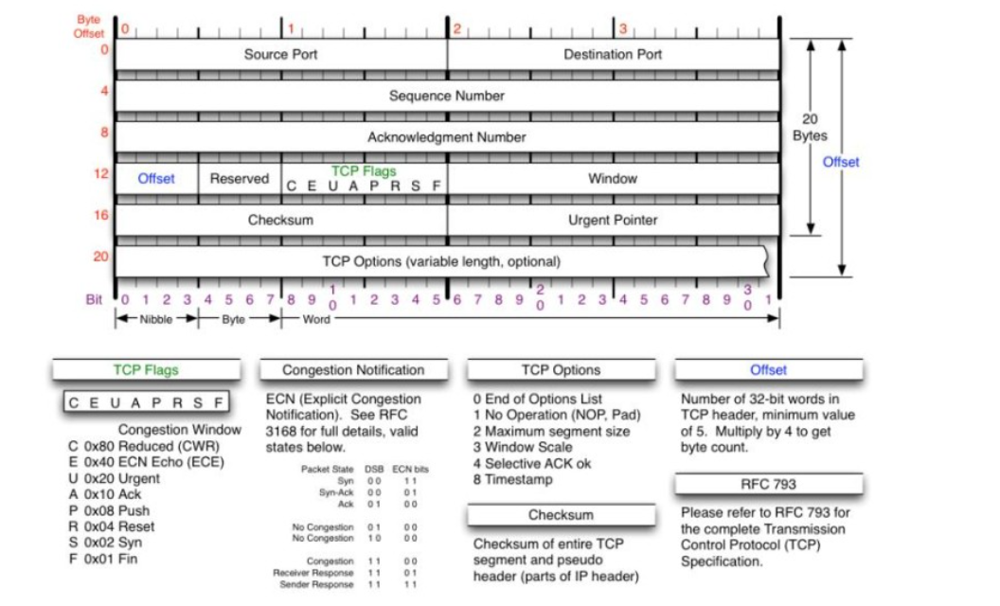
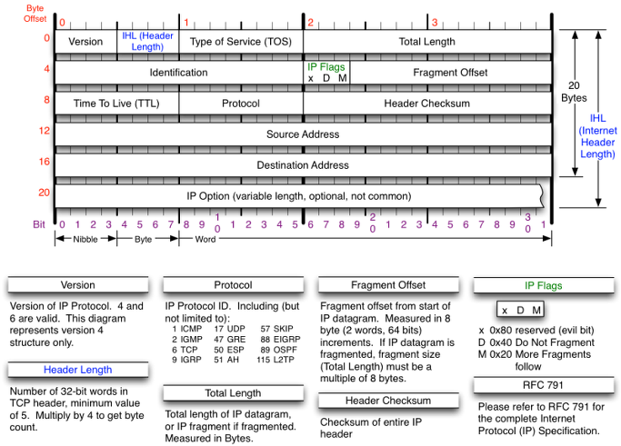
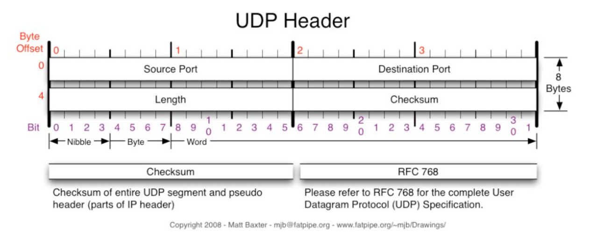
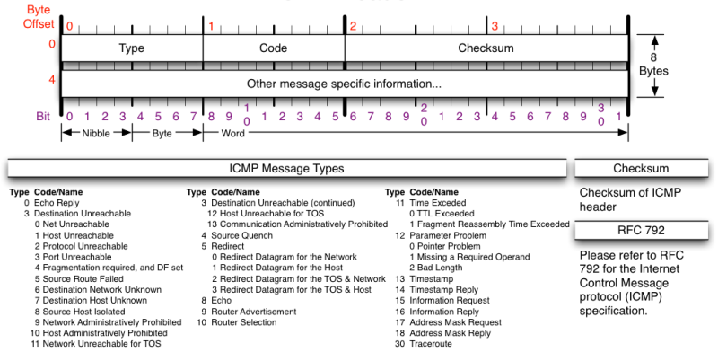
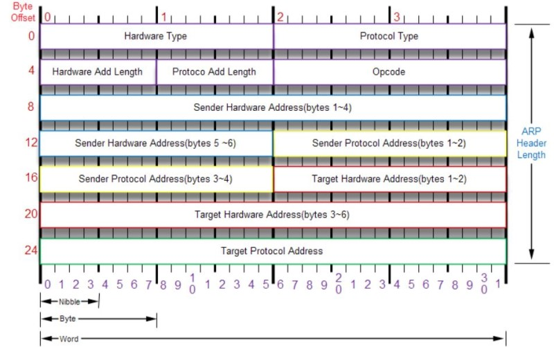

# MTU, MSS 이야기
### MTU(Maximum Transmission Unit)
- 네트워크에서 한 번에 보낼 수 있는 최대 데이터 크기(헤더 포함)
- 단위는 Outet(옥텟)이며 Byte와 같은 사이즈(1 Outet = 1 Byte)
- 일반적인 이더넷에서 수용할 수 있는 크기는 1,500 바이트
- MTU는 2계층의 데이터 값

### MSS(Maximum Segment Size)
- MSS는 4계층에서 가질 수 있는 최대 데이터 크기
- 순수하게 MTU에서 각종 헤더를 제외한 값
- 일반적인 IP 표준 헤더 20바이트
- 일반적인 TCP 표준 헤더 20바이트(추가되는 옵션 헤더 제외)
- 일반적인 이더넷인 경우 MSS 값은 1,460바이트(1500 - 20(IP) - 20(TCP))

### Header 크기
```
-    TCP Header: 20 Bytes(옵션 헤더 제외)
-    UDP Header:  8 Bytes
-   IPv4 Header: 20 Bytes
-   ICMP Header:  8 Bytes
-    GRE Header: 24 Bytes(IP Protocol 47, RFC 2784)
-   6in4 Header: 20 Bytes(IP Protocol 41, RFC 4213)
-   4in6 Header: 40 Bytes(RFC 6333)
-   MPLS Header:  4 Bytes
-   IEEE 802.1Q:  4 Bytes
- Q-in-Q Header:  8 Bytes
-  VxLAN Header: 50 Bytes
-    OTV Header: 42 Bytes
-   LISP Header: 36 Bytes(IPv4), 56 Bytes(IPv6)
-  NVGRE Header: 42 Bytes
-    STT Header: 54 Bytes
-  IPSec Header: 가변적이며 최대 93(?) Bytes
```

### IPSec VPN 용어 설명

#### 1. AH(Authentication Header)
- 송수신하는 IP패킷에 대한 인증을 제공한다.
- 데이터의 무결성을 보장한다.
- 패킷을 암호화하지 않는다. 기밀성을 보장하지 않는다.
- 인증 알고리즘(MD5-HMAC, SHA-HMAC)을 지원한다.

#### 2. ESP(Encapsulating Security Payload)
- 송수신하는 IP패킷에 대한 인증과 암호화를 실시한다.
- 데이터의 무결성과 기밀성을 보장한다.
- 인증 알고리즘(MD5-HMAC, SHA-HMAC)을 지원한다.
- 대칭키 암호화 알고리즘(DES, 3DES, AES)을 지원한다.
- AES일경우 40 Bytes(Seq 4 + SPI 4 + IV 16 + Trailer 16)

#### - ESP Overhead
```
  - Outer IP Header:        20 Bytes
  - Sequence Number:         4 Bytes
  - SPI:                     4 Bytes
  - Initialization Vector: 8 or 16 Bytes(DES or AES)
  - ESP Padding:         [0-15]Bytes
  - Padding Length:          1 Bytes
  - Next Header:             1 Bytes
  - Authentication Data: 12-32 Bytes(SHA-1 to SHA-512)
  - Total:              [50-93]Bytes
```
#### - Initialization Vector
```
  - AES: 16 Bytes
  - DES:  8 Bytes
```
#### - Authentication Data
```
  - MD5/SHA-1: 12 Bytes
  - SHA-256:   16 Bytes
  - SHA-384:   24 Bytes
  - SHA-512:   32 Bytes
```

#### 3. SA(Security Associations)
- AH와 ESP로 IPSec 서비스를 구현할 때, 암호화 및 인증에 사용할 요소를 SA로 정의한다.
- 가장 중요한 요소는 암/복호화 키의 수명이다.

#### 4. IKE(Internet Key Exchange)
- ISAKMP와 Oakley Protocol으로 결합된 (IPSec에서 사용되는) 키 관리 프로토콜이다.
- IKE는 상호 개체간 인증된 보안 통신 채널을 생성하고, SA 정보를 협상한다.

#### 5. 기타 정보
- 전송모드: 0 Bytes
- 터널모드: 20 Bytes
- 암호화/인증 알고리즘과 HMAC에 따라 오버헤드가 다름
- 터널 모드에서 2개의 IP 헤더가 전송됨. (내부, 외부)
- AES ESP 사용 시 이상적인 MSS는 1328 이라고 함
  - https://packetpushers.net/ipsec-bandwidth-overhead-using-aes/
- HMAC(Hash-based Message Authentication Code)
  - 해시 함수와 공유키를 사용한 메시지 인증 코드
- PMTUD(Path MTU Discovery)


### MTU 문제를 진단하는 빠르고 쉬운 방법
#### - Ping (Windows)
```
C:>ping /?

사용법: ping [-t] [-a] [-n count] [-l size] [-f] [-i TTL] [-v TOS]
            [-r count] [-s count] [[-j host-list] | [-k host-list]]
            [-w timeout] [-R] [-S srcaddr] [-c compartment] [-p]
            [-4] [-6] target_name

옵션:
    -l size        송신 버퍼 크기입니다.
    -f             패킷에 조각화 안 함 플래그를 설정(IPv4에만 해당)합니다.
```
- 일반적인 상황에서의 Ping
  - 표준 이더넷 MTU 1500 바이트
  - ICMP 헤더: 8 바이트
  - IP 헤더: 20 바이트
  - 최대 MSS: 1472 바이트(1500-8-20)
```
C:\Users\netcanuck>ping 172.16.32.1 -f -l 1472

Pinging 172.16.32.1 with 1472 bytes of data:
Reply from 172.16.32.1: bytes=1472 time=3ms TTL=251
Reply from 172.16.32.1: bytes=1472 time=4ms TTL=251
Reply from 172.16.32.1: bytes=1472 time=4ms TTL=251

C:\Users\netcanuck>ping 172.16.32.1 -f -l 1473

Pinging 172.16.32.1 with 1473 bytes of data:
Packet needs to be fragmented but DF set.
Packet needs to be fragmented but DF set.
Packet needs to be fragmented but DF set.
```
- IPSec 터널에서의 Ping
  - 표준 이더넷 MTU 1500 바이트
  - ICMP 헤더: 8 바이트
  - IP 헤더: 20 바이트
  - IPSec 헤더: 88 바이트 (이것은 직접 계산하고 테스트해서 찾아야 함)
  - 최대 MSS: 1384 바이트(1500-8-20-88)
```
C:\Users\netcanuck>ping 172.16.68.1 -f -l 1472

Pinging 172.16.68.1 with 1472 bytes of data:
Packet needs to be fragmented but DF set.
Packet needs to be fragmented but DF set.
Packet needs to be fragmented but DF set.

C:\Users\netcanuck>ping 172.16.68.1 -f -l 1384

Pinging 172.16.68.1 with 1472 bytes of data:
Reply from 172.16.68.1: bytes=1384 time=8ms TTL=251
Reply from 172.16.68.1: bytes=1384 time=9ms TTL=251
Reply from 172.16.68.1: bytes=1384 time=9ms TTL=251
```
#### - Ping (Linux)
```
Ubuntu# ping -h
Usage
  ping [options] <destination>

Options:
  <destination>      dns name or ip address
  -s <size>          use <size> as number of data bytes to be sent
  -M <pmtud opt>     define mtu discovery, can be one of <do|dont|want>


Ubuntu# ping -s 1472 -M do 192.168.25.25
PING 192.168.25.25 (192.168.25.25) 1472(1500) bytes of data.
1480 bytes from 192.168.25.25: icmp_seq=1 ttl=62 time=3.77 ms
1480 bytes from 192.168.25.25: icmp_seq=2 ttl=62 time=3.25 ms
1480 bytes from 192.168.25.25: icmp_seq=3 ttl=62 time=3.21 ms

Ubuntu# ping -s 1473 -M do 192.168.25.25
PING 192.168.25.25 (192.168.25.25) 1473(1501) bytes of data.
From 192.168.25.26 icmp_seq=1 Frag needed and DF set (mtu = 1500)
ping: local error: message too long, mtu=1500
ping: local error: message too long, mtu=1500
ping: local error: message too long, mtu=1500
```

### Header 구조
- TCP Header


- IP Header


- UDP Header


- ICMP Header


- ARP Header

